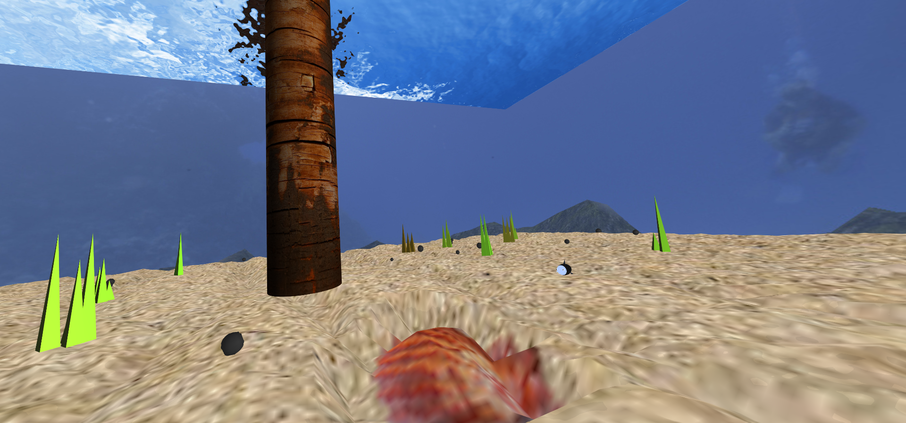

# CGRA 2020/2021

## Group T07G06

Ana Beatriz Melo Aguiar - up201906230
Tiago Caldas da Silva - up201906045

## Project Notes

Underseas WebGL scene built using WebCGF that contains:
- Ocean environment 
    - SeaFloor
    - Surrounding waters
    - Ocean top(Pier) with water movement 
- Main fish, animated and controlled with the following commands
    - ``W`` -  move forward and increase horizontal speed
    - ``S`` -  decrease horizontal speed
    - ``D`` -  turn right
    - ``A`` -  turn left
    - ``L`` -  move upwards
    - ``P`` -  move downwards
    - ``C`` -  pick a rock, if sufficiently closer to a rock
            -  drop a rock, if sufficiently near nest
    - ``R`` -  reset the fish and rocks to its initial position 
    - ``T`` -  throw rock, from the upper position to the nest,  using       Hermite curves
    - Change texture in interface
- Set of animated fishes, with random textures
- Set of random displayed rocks
- Set of wooden pillars

Being generalitty and efficiency a main goal, it was decided by the group to create a Class [Utils](Utils.js) that incorporates the most commonly used functions:
- Class [Utils](Utils.js)
    - Distance calculations
    - Random generators
        - for e.g. in the [RandomFishSet.js](RandomFishSet.js), random functions are used to calculate the rotation period, number of fish, textures and colors.
    - Geometric transformations (e.g: [Translate()](Utils.js#L2))
        - transformations are essential and used in every displayed class object. This class was a successfull attempt to simplify and beautify our code, instead of creating random matrixes for every minimal transformation, Utils is used.

## Screenshots

### 1 - MyFish

### 2 - MySeaFloor

### 3 - MyPier

### 4 - MyRock

### 5 - MyPillar

### 6 - Overview

### 7 - Dropping Rocks

### 7 - Additional Features

